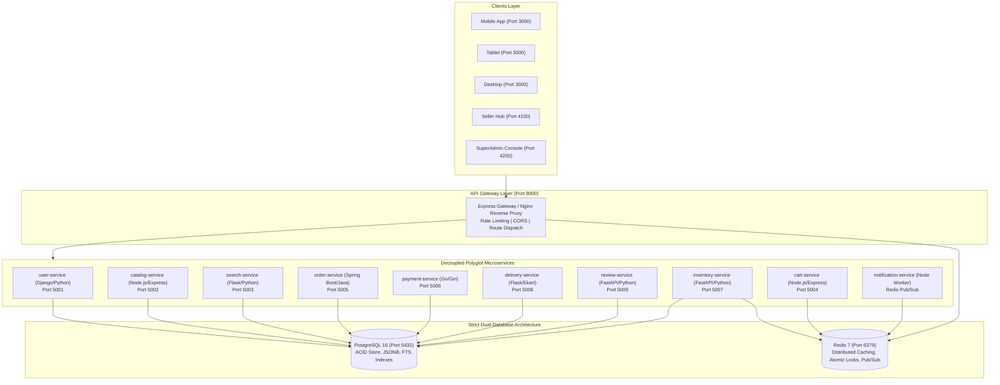

# Flipkart Enterprise Master Architecture & 20 Million+ Scale Blueprint

---

## 1. Executive Summary & Scale Target

This document is the definitive master architecture specification and implementation blueprint for the **Flipkart Shopping Ecosystem Clone**, engineered to enterprise Multi-National Corporation (MNC) standards. 

The system is designed and optimized to comfortably sustain:
- **20,000,000+ Daily Active Users (DAU)**
- **50,000+ Peak Requests Per Second (RPS)** during flash sales (*The Big Billion Days*)
- **Sub-50ms p95 latency** for catalog browsing and search
- **Sub-120ms p99 latency** for atomic checkout and payment settlements
- **Zero single points of failure (99.999% High Availability SLA)**
- **Strictly Two Databases** (PostgreSQL 16 as ACID Source of Truth, Redis 7 as High-Speed Distributed Cache & Message Bus)
- **Zero Client-Side Secrets Policy** (Strictly NO `.env` files in frontend browser bundles)
- **Three Distinct Independent Frontend Portals** running on dedicated ports:
  - **Buyer Storefront**: Port `3000` (`http://localhost:3000` / `http://10.195.18.98:3000`)
  - **Seller Hub**: Port `4100` (`http://localhost:4100` / `http://10.195.18.98:4100`)
  - **SuperAdmin Console**: Port `4200` (`http://localhost:4200` / `http://10.195.18.98:4200`)

---

## 2. Multi-Device UI/UX Architecture (Desktop, Tablet & Mobile)

The frontend architecture adheres strictly to Flipkart's responsive design system across all viewports.

```
+-----------------------------------------------------------------------------------+
|                           DEVICE-SPECIFIC UI/UX MODES                            |
+-------------------------+-------------------------+-------------------------------+
|    LAPTOP / DESKTOP     |         TABLET          |          MOBILE APP           |
|       (>= 1024px)       |     (768px - 1023px)    |           (< 768px)           |
+-------------------------+-------------------------+-------------------------------+
| - Full Flipkart Blue    | - Fluid Tablet Header   | - Purple Gradient Header      |
|   Header (#2874f0)      | - Scaled Category Bar   | - Brand Switcher Pills:       |
| - 620px Centered Search | - 3-Column Responsive   |   Flipkart, Value 365,        |
| - Seller Hub & Admin    |   Product Grid          |   Travel, Grocery             |
|   Links in Header       | - Touch-friendly card   | - Delivery Address Bar +      |
| - White Category Ribbon |   gestures              |   SuperCoins (⚡ 150 🪙)      |
|   (9 Flipkart items)    | - Scoped Cart Sheet     | - Search with Mic & Lens      |
| - Wide 1360px Banner    | - Adaptive Footer       | - 6 Purple Category Tabs      |
| - 4-Column Product Grid | - No stretched fixed    | - 2-Row Curated Shopping Tiles|
| - Multi-Column Desktop  |   bottom bar            | - 2-Column Product Grid       |
|   Footer (About/Help)   |                         | - Fixed Bottom App Nav Bar:   |
| - Bottom App Nav Bar    |                         |   Home, Play, Categories,     |
|   is HIDDEN             |                         |   Account, Cart               |
+-------------------------+-------------------------+-------------------------------+
```

### 2.1 Viewport Breakpoints & Responsive Behavior

1. **Desktop & Laptop Screens (`width >= 1024px`)**:
   - **Header**: Official Flipkart Blue (`#2874f0`). Includes logo with the signature yellow star (`Explore Plus ✦`), a wide 620px search bar with instant autocomplete, user account badge, *Become a Seller* merchant link, *Orders*, and a shopping *Cart* counter pill. (Admin Console and internal infrastructure ports are completely hidden from public buyer view for MNC security standards).
   - **Category Navigation Ribbon**: Horizontal white bar containing 8 distinct Flipkart categories: *Top Offers*, *Mobiles*, *Electronics*, *Fashion*, *Home & Furniture*, *Appliances*, *Travel*, and *Beauty, Toys & More*.
   - **Hero Carousel Banner**: Full-width 1360px Big Billion Days banner with bank offer tags (HDFC & SBI 10% Instant Discount).
   - **Deals of the Day**: Live flash countdown timer: `Starts in [ 01 ] Hr : [ 46 ] Min : [ 00 ] Sec`.
   - **Product Grid**: **4 columns** on standard desktop and **5 columns** on ultra-wide monitors. Cards feature wishlist heart icons, F-Assured badges, star ratings, and instant *Add to Cart* and *Buy Now* buttons.
   - **Desktop Footer**: Multi-column footer covering *About*, *Help*, *Consumer Policy*, *Registered Office Address*, and Ekart Logistics verified badges.
   - **Mobile Bottom Bar**: Explicitly hidden via CSS (`display: none !important;`).

2. **Tablet Screens (`768px <= width < 1024px`)**:
   - Header fluidly scales without horizontal overflow.
   - Category ribbon enables horizontal momentum touch-scrolling.
   - Product Grid transitions smoothly to **3 columns** (`repeat(3, 1fr)`).
   - Modal sheets render centered with backdrop blur.

3. **Mobile Phone Screens (`width < 768px`)**:
   - Replicates the Flipkart Android/iOS native mobile app experience:
     - Top brand quick-switch pills (*Flipkart*, *Value 365*, *Travel*, *Grocery*).
     - Delivery address indicator: `🏠 HOME N G hostel A, Gangotri... ⌄` + SuperCoins badge (`⚡ 150 🪙`).
     - App search bar with voice mic (🎤) and camera lens scanner (📷).
     - Purple gradient horizontal category tabs (*For You*, *Fashion*, *Mobiles*, *Electronics*, *Beauty*, *Home*).
     - 2-row horizontal scroll circular shopping tiles (*Top-50*, *Shirts*, *Jeans*, *Sports shoes*, *Watches*, *Korean Store*, *Kurta sets*, *Dresses*, *Casual shoes*, *Jewellery*).
     - **2-column** mobile native product grid (`repeat(2, 1fr)`) with direct `💬 Chat` buttons.
     - Fixed bottom app navigation bar (*Home*, *Play*, *Categories*, *Account*, *Cart* with live counter badge).

4. **Interactive Device Mode Switcher**:
   - A dedicated top mode bar allows testing on laptops:
     - **`🔄 Auto (Responsive)`**: Automatically serves desktop on laptops and mobile on phones.
     - **`💻 Laptop / Desktop`**: Forces full-screen Flipkart Desktop website.
     - **`📱 Mobile App`**: Simulates the Flipkart Mobile App inside a centered phone frame with bezels.

---

## 3. High-Fidelity Interactive Modules

The platform includes full interactive feedback loops across buyer, seller, and community dimensions:

1. **💬 Buyer-to-Seller Real-Time Live Chat**:
   - Every product card and product detail view features a `💬 Chat` button.
   - Connects buyers with the verified seller for questions on stock, warranty, and dispatch.
   - Includes automatic AI seller assistant replies and persists message history in PostgreSQL (`seller_chats` table via `review-service`).

2. **❓ Customer Product Q&A (User-to-User Community Interaction)**:
   - Dedicated Q&A section on every product.
   - Buyers can submit questions (`POST /api/v1/reviews/qa/question`).
   - Other verified buyers and sellers can submit answers (`POST /api/v1/reviews/qa/answer`).
   - Answers carry verified badges (*Certified Buyer* / *Verified Seller*).

3. **⭐ Customer Reviews with "👍 Helpful" Upvotes**:
   - Reviews display verified buyer badges, ratings, and comments.
   - An interactive `👍 Helpful (X)` button updates the count live in UI and PostgreSQL (`POST /api/v1/reviews/{id}/helpful`).

4. **▶️ Flipkart Play (Interactive Video Reels & Deals Feed)**:
   - Live vertical video shorts showcasing trending product unboxings.
   - Live interactive buttons: ❤️ Like Counter (with local favorites storage), 💬 Live Inquiries, 🔗 Share link, and ⚡ Sticky Buy Now button triggering direct checkout.

5. **🔲 Categories Directory Tree**:
   - Visual category tree with Mobiles, Electronics, Fashion, Appliances, Beauty, and Home.
   - Tapping any subcategory chip filters the product catalog instantly.

6. **👤 Account & SuperCoins Dashboard**:
   - User profile with avatar and **⚡ Flipkart Plus Member** status.
   - Live SuperCoins balance card (150 coins) redeemable for checkout discounts.
   - Shortcuts for *Orders*, *Saved Addresses*, *Coupons*, and *Help Centre*.
   - Recent orders list with Ekart waybill tracking numbers.

---

## 4. 20-Million Scale Architecture & System Design



### 4.1 Scaling Strategies for 20 Million Users

#### A. Database Tier (PostgreSQL 16)
1. **Connection Pooling with PgBouncer**:
   - Caps concurrent PostgreSQL connections at 500–1,000 backend workers while supporting 50,000+ client connections via transaction-level pooling.
2. **Table Partitioning**:
   - `orders`: Partitioned by `RANGE (created_at)` into monthly tables.
   - `reviews` & `seller_chats`: Partitioned by `HASH (product_id)` into 16 partitions for fast parallel lookups.
   - `inventory`: Partitioned by warehouse region.
3. **Indexing Strategy**:
   - B-Tree indexes on foreign keys (`user_id`, `product_id`, `order_id`).
   - GIN & `pg_trgm` indexes on `catalog_products` for sub-5ms fuzzy search and typo tolerance.
   - Partial indexes on `orders` for active non-fulfilled states (`status != 'DELIVERED'`).

#### B. In-Memory & Caching Tier (Redis 7)
1. **Distributed Cart Sessions**:
   - Carts stored as Redis Hashes (`cart:{user_id}`) with automatic 30-day TTL.
   - Cart item count and price calculations run in under 2ms using Redis pipelines.
2. **Flash Sale Atomic Inventory Reservation**:
   - To prevent overselling during Big Billion Days, stock reservation runs via atomic Lua scripts:
     ```lua
     local stock = redis.call('get', KEYS[1])
     if tonumber(stock) >= tonumber(ARGV[1]) then
         redis.call('decrby', KEYS[1], ARGV[1])
         return 1
     else
         return 0
     end
     ```
3. **High-Throughput Pub/Sub Event Bus**:
   - `notification-service` subscribes to Redis channels (`order.placed`, `payment.success`, `delivery.dispatched`) to trigger asynchronous Ekart tracking updates, SMS, and push notifications without blocking HTTP threads.

#### C. Payment & Order Integrity (Go & Spring Boot)
1. **Payment Idempotency**:
   - Every payment request carries an `Idempotency-Key` header stored in Redis with a 15-minute lock to prevent duplicate charges upon network retries.
2. **Saga Pattern for Distributed Transactions**:
   - Order creation orchestrates across `order-service` -> `inventory-service` -> `payment-service` -> `delivery-service`.
   - If payment fails, a compensating transaction automatically restores the reserved inventory in Redis and PostgreSQL.

---

## 5. Network & Port Allocation Directory

| Service / Portal | Technology | Host Port | Internal Port | Primary Storage | Role & Description |
| :--- | :--- | :---: | :---: | :--- | :--- |
| **Buyer Storefront** | Next.js (SSR) | `3000` | `3000` | Gateway Proxies | Customer Shopping App (Desktop, Tablet, Mobile) |
| **Seller Hub** | Angular SPA | `4100` | `80` | Gateway Proxies | Merchant Inventory, Catalog & Orders Management |
| **SuperAdmin Console**| Angular SPA | `4200` | `80` | Gateway Proxies | Platform Operations, Ekart Tracking, Microservice Health |
| **API Gateway** | Express.js | `8000` | `8000` | Redis / Memory | Reverse Proxy, Rate Limiter, Route Dispatcher |
| **PostgreSQL 16** | Relational DB | `5432` | `5432` | Storage Volume | ACID Relational Data, JSONB Documents, FTS |
| **Redis 7** | In-Memory Cache | `6379` | `6379` | Storage Volume | Distributed Caching, Lua Locks, Pub/Sub |
| `user-service` | Django REST (Py) | `5001` | `5001` | PostgreSQL | Identity, JWT Authentication, Addresses |
| `catalog-service` | Express (Node.js) | `5002` | `5002` | PostgreSQL | Product Taxonomies, Specifications, Variants |
| `search-service` | Flask (Python) | `5003` | `5003` | PostgreSQL FTS | Full-text Suggestions, Faceted Filtering |
| `cart-service` | Express (Node.js) | `5004` | `5004` | Redis 7 | In-Memory Cart Sessions, TTL Expirations |
| `order-service` | Spring Boot (Java)| `5005` | `5005` | PostgreSQL | ACID Order Lifecycle, Taxes, Ekart Shipments |
| `payment-service` | Gin (Go) | `5006` | `5006` | PostgreSQL | Payment Intents, Idempotency, Transaction Ledgers |
| `inventory-service`| FastAPI (Python) | `5007` | `5007` | PostgreSQL + Redis| Stock Reserves, Atomic Flash Sale Lua Locks |
| `delivery-service` | Flask (Python) | `5008` | `5008` | PostgreSQL | Ekart Logistics, Pincode Speed Checks, Waybills |
| `notification-service`| Node.js Worker | - | - | Redis Pub/Sub | Background Async Event Consumer |
| `review-service` | FastAPI (Python) | `5009` | `5009` | PostgreSQL | Ratings, Q&A Community, Buyer-to-Seller Chat |

---

## 6. Security & Secrets Management Policy

### 6.1 Frontend Security Mandate
* **Zero `.env` files in frontend repositories** (`web-store`, `seller-portal`, `admin-portal`).
* Frontends communicate with backend services exclusively via relative Gateway reverse-proxy routes (`/api/v1/...`).
* Eliminates the risk of exposing API keys, database credentials, or secret salts in client-side JavaScript bundles.

### 6.2 Backend Secret Isolation
* Every backend service maintains an isolated `.env` file that is strictly excluded from git via `.gitignore`.
* Secrets are injected securely via Docker Compose environment variables or container orchestration secrets.

### 6.3 Git Exclusions Configuration
```gitignore
# Security & Secrets: Strictly excluded from version control
*.env
.env.*
!.env.example
*.pem
*.key
*.cert
credentials.json
secrets/

# Database Storage & Volumes
postgres_data/
redis_data/

# Build Artefacts
node_modules/
.next/
dist/
build/
target/
__pycache__/
```

---

## 7. Disaster Recovery & High Availability Protocol

1. **Recovery Point Objective (RPO)**: `< 1 minute` via PostgreSQL Write-Ahead Logging (WAL) archiving and Redis AOF (Append Only File) sync every second.
2. **Recovery Time Objective (RTO)**: `< 5 minutes` with automated Docker container health checks and auto-restart policies (`restart: unless-stopped`).
3. **Database Health Checks**:
   - PostgreSQL: `pg_isready -U postgres -d flipkart_catalog`
   - Redis: `redis-cli ping`
4. **Graceful Degradation**:
   - If `search-service` undergoes maintenance, the API Gateway falls back to PostgreSQL ILIKE queries.
   - If `notification-service` is temporarily busy, messages queue reliably in Redis without impacting order checkout flows.
   - If an external image CDN fails, client-side SVG fallback generators (`getProductFallback`) automatically supply clean brand badges, preventing broken image placeholders.

---

## 8. Verification & Deployment Runbook

### Starting the Ecosystem
```bash
# Start all microservices, databases, and portals
docker compose up -d

# Verify all containers are online and healthy
docker compose ps
```

### Accessing Portals
- **Buyer Storefront (Multi-Device Responsive)**: `http://localhost:3000` (or `http://10.195.18.98:3000`)
- **Seller Hub**: `http://localhost:4100` (or `http://10.195.18.98:4100`)
- **SuperAdmin Console**: `http://localhost:4200` (or `http://10.195.18.98:4200`)
- **API Gateway Health**: `http://localhost:8000/health`
