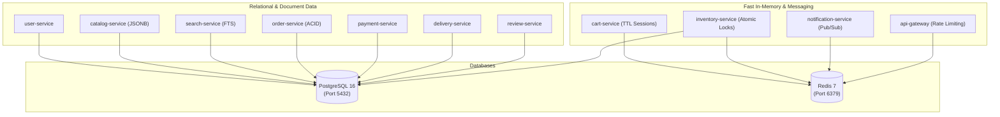

# Project Architecture & Implementation Plan: Flipkart Clone

## 1. Executive Summary
This document outlines the architectural plan for building a full-featured, scalable **Flipkart Shopping App Clone**. The system is built on an enterprise-grade **polyglot microservices architecture** orchestrated via **Docker & Docker Compose**, using strictly **two databases** (PostgreSQL and Redis) and enforcing a strict **backend-only `.env` security policy**.

---

## 2. Core Architecture Principles

1. **Polyglot Services**: Backend microservices leverage optimal programming languages and frameworks best suited for their technical domain (Python, Node.js, Java, and Go).
2. **Strict Dual-Database Strategy**: 
   - **PostgreSQL 16**: Primary data store for relational models, document storage (via `JSONB`), and search indexing (via `pg_trgm` / `tsvector`).
   - **Redis 7**: High-speed in-memory store for cart caching, flash-sale stock locks, rate limiting, and notification Pub/Sub messaging.
3. **Frontend Security Policy**:
   - **Zero `.env` files on frontend clients** to eliminate any risk of secret leakage into client-side browser bundles.
   - Frontend apps only interact with the API Gateway via public endpoints/proxies.
4. **Backend Secret Isolation**:
   - Every backend microservice and gateway has its own isolated `.env` file for credentials, salts, and API keys.
   - All `.env` files are strictly excluded from source control via `.gitignore`.
5. **Container-First Deployment**:
   - Every service is containerized with a dedicated `Dockerfile`.
   - The entire ecosystem spins up with a single `docker compose up` command.

---

## 3. Technology Stack Breakdown

### Frontend Applications (No `.env` Files)
| Application | Language | Framework | Role & Description |
| :--- | :--- | :--- | :--- |
| **Customer Storefront** | TypeScript | **Next.js (React)** | Customer shopping web application with Server-Side Rendering (SSR) for SEO, dynamic product pages, cart, checkout, and order history. |
| **Admin & Seller Portal** | TypeScript | **Angular** | Enterprise SPA for seller product onboarding, stock management, order fulfillment, and admin platform analytics. |

---

### API Gateway
| Component | Language | Framework | Role & Description |
| :--- | :--- | :--- | :--- |
| **API Gateway** | JavaScript / TypeScript | **Express.js (Node.js)** | Single entry point on port `8000`. Handles reverse proxying, rate limiting, request validation, and routes requests to internal microservices. |

---

### Backend Microservices (Polyglot)
| Service Name | Language | Framework | Primary Data Store | Responsibilities |
| :--- | :--- | :--- | :--- | :--- |
| **`user-service`** | Python | **Django REST** | PostgreSQL | User accounts, seller verification, profile management, addresses, and JWT issuance. |
| **`catalog-service`** | JavaScript / TS | **Express.js (Node.js)** | PostgreSQL (`JSONB`) | Product catalog, multi-category taxonomy, brand specifications, and variant definitions. |
| **`search-service`** | Python | **Flask** | PostgreSQL (`Full-Text / pg_trgm`) | Fast auto-suggestions, typo tolerance, sorting, and faceted filtering (price, ratings, brand). |
| **`cart-service`** | JavaScript / TS | **Express.js (Node.js)** | **Redis** | In-memory shopping carts, guest-to-user cart merging, and session-based wishlists with automatic TTL expiration. |
| **`order-service`** | Java | **Spring Boot** | PostgreSQL | Strict ACID-compliant order lifecycle (Placed, Confirmed, Shipped, Delivered, Cancelled), tax calculation, and invoices. |
| **`payment-service`** | Go (Golang) | **Gin** | PostgreSQL | High-concurrency payment intent creation, gateway webhooks (Razorpay/Stripe mock), refunds, and transaction ledgers. |
| **`inventory-service`**| Python | **FastAPI** | PostgreSQL + **Redis** | Real-time warehouse inventory, flash-sale atomic locks using Redis to prevent double selling. |
| **`delivery-service`** | Python | **Flask** | PostgreSQL | Ekart logistics clone: Pincode serviceability checks, tracking status updates, and shipment dispatch timelines. |
| **`notification-service`**| JavaScript / TS | **Node.js Worker** | **Redis Pub/Sub** | Asynchronous consumer listening for event triggers to send order confirmations, OTPs, and push alerts. |
| **`review-service`** | Python | **FastAPI** | PostgreSQL | Customer reviews, ratings, verified buyer badges, and product ratings aggregation. |

---

## 4. Database Architecture (Strictly 2 Databases)



---

## 5. Security & Environment Configuration

### Frontend Security Rule
* Frontend builds contain **NO `.env` files**.
* Any environment config needed by the browser is restricted to public base URLs passed at runtime or standard relative reverse-proxy routing (`/api/v1/...`).

### Backend `.env` Isolation Strategy
Each backend service manages its own `.env` file for strictly isolated secrets:

* `gateway/.env` $\rightarrow$ Port numbers, CORS origins, JWT verification keys.
* `services/user-service/.env` $\rightarrow$ DB credentials, JWT private signing key, password salt rounds.
* `services/catalog-service/.env` $\rightarrow$ DB credentials, media upload credentials.
* `services/search-service/.env` $\rightarrow$ DB connection string, search indexing configs.
* `services/cart-service/.env` $\rightarrow$ Redis connection URL, password, TTL values.
* `services/order-service/.env` $\rightarrow$ DB credentials, invoice generation secret key.
* `services/payment-service/.env` $\rightarrow$ DB credentials, payment gateway keys, webhook secret.
* `services/inventory-service/.env` $\rightarrow$ DB credentials, Redis lock connection strings.
* `services/delivery-service/.env` $\rightarrow$ DB credentials, logistics API keys.
* `services/notification-service/.env` $\rightarrow$ Redis Pub/Sub credentials, SMTP/SMS provider credentials.
* `services/review-service/.env` $\rightarrow$ DB credentials.

### Git Exclusions (`.gitignore`)
```gitignore
# Security: Never commit secret files
*.env
.env.*
!.env.example
```
Each backend service maintains a `.env.example` file detailing all required configuration variable names with placeholder values.

---

## 6. Docker & Containerization Plan

### Container Network & Port Allocations
* **Network**: `flipkart-network` (Internal Docker bridge network)
* **Volumes**:
  * `postgres_data` $\rightarrow$ `/var/lib/postgresql/data`
  * `redis_data` $\rightarrow$ `/data`

| Container Name | Base Image / Runtime | Host Port | Internal Port | Depends On |
| :--- | :--- | :---: | :---: | :--- |
| `flipkart-postgres` | `postgres:16-alpine` | `5432` | `5432` | None (Healthcheck) |
| `flipkart-redis` | `redis:7-alpine` | `6379` | `6379` | None (Healthcheck) |
| `api-gateway` | Node.js Alpine | `8000` | `8000` | `postgres`, `redis` |
| `web-client` | Node.js Alpine (Next.js) | `3000` | `3000` | `api-gateway` |
| `admin-client` | Nginx Alpine (Angular) | `4200` | `80` | `api-gateway` |
| `user-service` | Python 3.11 Slim | Internal | `5001` | `postgres` |
| `catalog-service` | Node.js Alpine | Internal | `5002` | `postgres` |
| `search-service` | Python 3.11 Slim | Internal | `5003` | `postgres` |
| `cart-service` | Node.js Alpine | Internal | `5004` | `redis` |
| `order-service` | Eclipse Temurin (Java 21) | Internal | `5005` | `postgres` |
| `payment-service` | Golang Alpine | Internal | `5006` | `postgres` |
| `inventory-service`| Python 3.11 Slim | Internal | `5007` | `postgres`, `redis` |
| `delivery-service` | Python 3.11 Slim | Internal | `5008` | `postgres` |
| `notification-service` | Node.js Alpine | Worker | - | `redis` |
| `review-service` | Python 3.11 Slim | Internal | `5009` | `postgres` |

---

## 7. Project Directory Layout

```text
Flipkart/
├── PLAN.md                               # This master architecture document
├── docker-compose.yml                     # Root container orchestrator
├── .gitignore                             # Global gitignore ignoring all *.env
│
├── databases/
│   └── init/
│       └── 01-create-databases.sql       # Creates schemas/databases in PostgreSQL
│
├── gateway/
│   ├── Dockerfile
│   ├── .env.example                      # Template without real secrets
│   └── (Express.js source files)
│
├── frontend/
│   ├── web-store/                         # Next.js customer application (NO .env)
│   │   ├── Dockerfile
│   │   └── src/
│   └── admin-portal/                      # Angular seller/admin application (NO .env)
│       ├── Dockerfile
│       └── src/
│
└── services/
    ├── user-service/                      # Python / Django REST
    │   ├── Dockerfile
    │   └── .env.example
    ├── catalog-service/                   # Node.js / Express
    │   ├── Dockerfile
    │   └── .env.example
    ├── search-service/                    # Python / Flask
    │   ├── Dockerfile
    │   └── .env.example
    ├── cart-service/                      # Node.js / Express
    │   ├── Dockerfile
    │   └── .env.example
    ├── order-service/                     # Java / Spring Boot
    │   ├── Dockerfile
    │   └── .env.example
    ├── payment-service/                   # Go / Gin
    │   ├── Dockerfile
    │   └── .env.example
    ├── inventory-service/                 # Python / FastAPI
    │   ├── Dockerfile
    │   └── .env.example
    ├── delivery-service/                  # Python / Flask (Ekart Clone)
    │   ├── Dockerfile
    │   └── .env.example
    ├── notification-service/              # Node.js Pub/Sub Worker
    │   ├── Dockerfile
    │   └── .env.example
    └── review-service/                    # Python / FastAPI
        ├── Dockerfile
        └── .env.example
```

---

## 8. Implementation Phases

* **Phase 1**: Project Root Setup (`.gitignore`, initial directory structure, database initialization scripts).
* **Phase 2**: Docker Compose Orchestration (`docker-compose.yml` for PostgreSQL and Redis with healthchecks).
* **Phase 3**: Core Data & Identity Services (`user-service`, `catalog-service`, `search-service`).
* **Phase 4**: Transactional & Logistics Services (`cart-service`, `order-service`, `payment-service`, `inventory-service`, `delivery-service`, `notification-service`).
* **Phase 5**: API Gateway routing & security policies.
* **Phase 6**: Frontend applications (`web-store` in Next.js and `admin-portal` in Angular).
